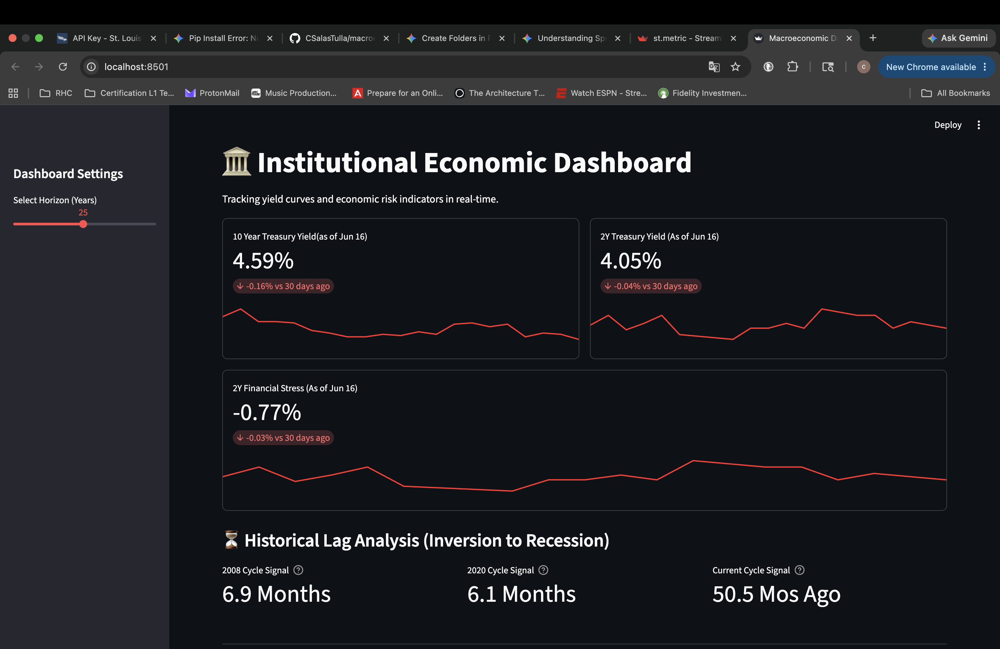
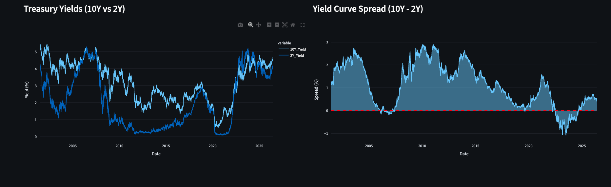

# Automated Macroeconomic Risk Dashboard

An interactive, web-based financial analytics terminal built with **Python**, **Streamlit**, and **Plotly**. This dashboard connects directly to the **Federal Reserve Economic Data (FRED) API** to fetch, analyze, and visualize crucial macroeconomic indicators, specifically tracking historical Treasury Yields, the Yield Curve Spread, and automated recession regime shading.

## 📱 Interface Preview

## 📊 Core Features
* **Real-time Data Fetching:** Dynamic API integration with FRED for the latest macroeconomic indicators.
* **Yield Curve Analysis:** Side-by-side visualization of the 10-Year vs. 2-Year Treasury Yields and the current Yield Curve Spread.
* **Automated Regime Shading:** Custom algorithmic grouping logic that automatically detects and shades distinct historical recession blocks on both charts based on economic indicator values.
* **Dynamic Interventions:** Visual highlights showing exact market timelines where the yield curve flipped negative (inversion).

---

## 🛠️ Installation & Setup

Follow these step-by-step instructions to get the dashboard running locally on your machine.

### Prerequisites
Make sure you have Python 3.8+ installed on your computer. You will also need a free API key from the Federal Reserve Bank of St. Louis. 
* Get a free FRED API Key at fredaccount.stlouisfed.org

### STEP 1: Clone the Repository
Open your terminal and clone the repository to your local directory:
git clone [https://github.com/CSalasTulla/macroeconomic-risk-dashboard.git](https://github.com/CSalasTulla/macroeconomic-risk-dashboard.git)
cd macroeconomic-risk-dashboard

### STEP 2: Create & Activate the Virtual Environment
python -m venv venv

On macOS/Linux activation:
source venv/bin/activate

On Windows activation:
.\venv\Scripts\activate

### STEP 3: Install Dependencies
pip install -r requirements.txt

### STEP 4: Configure Secure API Secrets in TOML
Create a file at `.streamlit/secrets.toml` and add your key:
FRED_API_KEY = "YOUR_ACTUAL_API_KEY_HERE"

### STEP 5: Run the App in Terminal
streamlit run app.py
